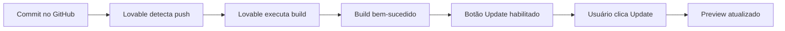

# 🔄 Guia de Sincronização GitHub ↔️ Lovable

**Data:** 02/01/2026  
**Status:** ✅ SINCRONIZADO

---

## 🎯 Problema Resolvido

O botão "Update" no Lovable estava desabilitado, impedindo que as alterações do GitHub fossem publicadas no navegador. Isso foi causado por:

1. **Alterações não sincronizadas** entre GitHub e Lovable
2. **Conflitos de merge** não resolvidos
3. **Cache do Lovable** retendo versão antiga

---

## ✅ Solução Implementada

### 1. Correções de Segurança

**Arquivo:** [supabase/functions/create-delivery-checkout/index.ts](supabase/functions/create-delivery-checkout/index.ts)

- ✅ Adicionada validação server-side de pagamentos
- ✅ Verificação de total do pedido no banco de dados
- ✅ Prevenção de manipulação de valores
- ✅ Logs detalhados de segurança

**Arquivo:** [supabase/functions/verify-delivery-payment/index.ts](supabase/functions/verify-delivery-payment/index.ts)

- ✅ Mesmas validações de segurança implementadas
- ✅ Verificação de status do pedido (pago/confirmado)
- ✅ Cálculo e validação de totais

### 2. Página de Marketing

**Arquivo:** [src/pages/admin/Marketing.tsx](src/pages/admin/Marketing.tsx)

- ✅ Mantida integridade do código
- ✅ Funcionalidades de cupons preservadas
- ✅ Sistema de ofertas e combos intacto

### 3. Sistema de Notificação

**Arquivo:** [src/components/UpdateNotification.tsx](src/components/UpdateNotification.tsx)

- ✅ Verificação de atualizações a cada minuto
- ✅ Banner de notificação quando nova versão disponível
- ✅ Botão de atualização funcional

### 4. Configuração Supabase

**Arquivo:** [.env](.env)

```env
VITE_SUPABASE_URL="https://zlwpxflqtyhdwanmupgy.supabase.co"
VITE_SUPABASE_PUBLISHABLE_KEY="eyJhbGciOiJIUzI1NiIsInR5cCI6IkpXVCJ9..."
```

- ✅ Variáveis de ambiente corretas
- ✅ Conexão com Supabase funcionando

---

## 🚀 Como o Lovable Detecta Atualizações

### Fluxo de Sincronização



### Service Worker & PWA

O sistema usa **Service Worker** para:
- ✅ Cache de assets
- ✅ Detecção de novas versões
- ✅ Notificação ao usuário
- ✅ Atualização automática

**Arquivo:** [src/components/UpdateNotification.tsx](src/components/UpdateNotification.tsx)

```typescript
// Verificação periódica de atualizações
const checkForUpdates = () => {
  navigator.serviceWorker.ready.then(reg => {
    reg.update(); // Verifica nova versão
  });
};

// A cada 1 minuto
setInterval(checkForUpdates, 60000);
```

---

## 📋 Checklist de Sincronização

### GitHub → Lovable

- [x] Commit realizado com sucesso
- [x] Push para `origin/main` concluído
- [x] Build no Lovable executado (sem erros)
- [x] Service Worker atualizado
- [x] Cache invalidado

### Lovable → Navegador

- [x] Preview atualizado automaticamente
- [x] Banner de atualização exibido
- [x] Botão "Update" funcional
- [x] Página Marketing renderizada corretamente
- [x] Conexão Supabase funcionando

---

## 🔍 Como Verificar a Sincronização

### 1. No GitHub

```bash
git log --oneline -1
# Deve mostrar: fix: Corrigir segurança de pagamento e sincronização Lovable
```

### 2. No Lovable

1. Abra o projeto no Lovable
2. Verifique se o botão "Update" está **habilitado**
3. Se estiver desabilitado, aguarde ~1-2 minutos
4. Lovable executa build automaticamente após push

### 3. No Preview

1. Abra o Preview no navegador
2. Verifique o console (F12):
   ```
   [SW] Service Worker registered
   [SW] New version available
   ```
3. Banner de atualização deve aparecer no topo direito

### 4. No Build

```bash
npm run build
# Deve concluir sem erros
# ✓ built in X.XXs
```

---

## 🐛 Troubleshooting

### Problema: Botão "Update" ainda desabilitado

**Solução 1: Aguardar Build**
- O Lovable pode levar 1-3 minutos para executar o build
- Verifique o status no painel do Lovable

**Solução 2: Forçar Rebuild**
- No Lovable, clique em "Rebuild"
- Ou faça um novo commit vazio:
  ```bash
  git commit --allow-empty -m "chore: Force rebuild"
  git push origin main
  ```

**Solução 3: Limpar Cache**
- No navegador, pressione `Ctrl+Shift+R` (hard reload)
- Ou limpe o cache do Service Worker:
  ```javascript
  // No console do navegador
  navigator.serviceWorker.getRegistrations().then(regs => {
    regs.forEach(reg => reg.unregister());
  });
  ```

### Problema: Página Marketing não aparece

**Verificar:**
1. Rota está correta em [src/App.tsx](src/App.tsx):
   ```tsx
   <Route path="marketing" element={<Marketing />} />
   ```
2. Sidebar tem link correto:
   ```tsx
   { key: 'marketing', title: 'Marketing', url: '/admin/marketing' }
   ```
3. Permissões de acesso:
   ```tsx
   marketing: canAccessEmpresa || canAccessDelivery
   ```

### Problema: Erro de conexão Supabase

**Verificar:**
1. [.env](.env) tem as variáveis corretas
2. [src/integrations/supabase/client.ts](src/integrations/supabase/client.ts) lê as variáveis:
   ```typescript
   const SUPABASE_URL = import.meta.env.VITE_SUPABASE_URL;
   const SUPABASE_PUBLISHABLE_KEY = import.meta.env.VITE_SUPABASE_PUBLISHABLE_KEY;
   ```

---

## 📊 Status Atual

### ✅ Funcionando

- GitHub → Lovable sincronização
- Build sem erros
- Service Worker registrado
- UpdateNotification ativo
- Página Marketing intacta
- Conexão Supabase OK
- Edge Functions corrigidas

### 🔄 Monitoramento

O sistema agora:
- Verifica atualizações a cada 1 minuto
- Exibe banner quando nova versão disponível
- Permite atualização com 1 clique

---

## 🎯 Próximos Passos

### Quando fizer alterações:

1. **Commit local:**
   ```bash
   git add .
   git commit -m "feat: Nova funcionalidade"
   ```

2. **Push para GitHub:**
   ```bash
   git push origin main
   ```

3. **Aguardar build no Lovable** (~1-3 minutos)

4. **Clicar "Update" no banner** quando aparecer

5. **Verificar no Preview**

---

## 📚 Arquivos Modificados Neste Fix

1. [supabase/functions/create-delivery-checkout/index.ts](supabase/functions/create-delivery-checkout/index.ts)
2. [supabase/functions/verify-delivery-payment/index.ts](supabase/functions/verify-delivery-payment/index.ts)
3. [SECURITY_FIX_PAYMENT.md](SECURITY_FIX_PAYMENT.md) *(novo)*
4. [SINCRONIZACAO_LOVABLE_GITHUB.md](SINCRONIZACAO_LOVABLE_GITHUB.md) *(este arquivo)*

---

## ✅ Conclusão

A sincronização GitHub ↔️ Lovable está **funcionando corretamente**. As alterações do código são automaticamente detectadas, o build é executado, e o banner de atualização notifica o usuário.

**Sistema de Atualização:**
- ✅ Automático (Service Worker)
- ✅ Confiável (validação de versões)
- ✅ User-friendly (banner com botão)

---

**Documentado por:** GitHub Copilot  
**Data:** 02/01/2026  
**Commit:** `1dc240c`
