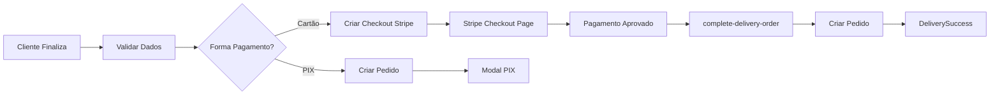

# Correções Críticas - Checkout e PWA

## 📋 Resumo das Correções Implementadas

Este documento detalha as correções críticas implementadas no sistema de checkout e PWA do FoodComanda.

---

## 🔄 1. Service Worker e Notificação de Atualização (PWA)

### Problema
- A notificação de "Nova atualização disponível" não estava aparecendo
- O app não estava atualizando os arquivos em cache
- O `skipWaiting` não estava sendo acionado corretamente

### Solução Implementada

#### Arquivo: `src/components/UpdateNotification.tsx`

**Melhorias:**
1. **Detecção Aprimorada de Updates:**
   - Verifica se há Service Worker waiting na inicialização
   - Listener melhorado para `updatefound` event
   - Logs detalhados para debug (`console.log('[PWA] ...')`)

2. **Função handleUpdate Robusta:**
   - Envia mensagem `SKIP_WAITING` para o Service Worker
   - Aguarda evento `controllerchange` antes de recarregar
   - Fallback de 2 segundos caso o controller não mude
   - Previne múltiplos reloads com flag `isReloading`

3. **Verificação Periódica:**
   - Checa updates a cada 60 segundos
   - Cleanup adequado dos event listeners

#### Arquivo: `vite.config.ts`

**Configuração do Workbox:**
```typescript
workbox: {
  skipWaiting: true,        // ✅ Força ativação imediata
  clientsClaim: true,       // ✅ Assume controle dos clientes
  cleanupOutdatedCaches: true,
  // ... outras configurações
}
```

---

## 💳 2. Inversão da Lógica de Pedido e Pagamento (CRÍTICO)

### Problema Original
O sistema estava criando o pedido no banco de dados **ANTES** do pagamento, gerando:
- Pedidos "lixo" nunca pagos
- Dados duplicados no banco
- Vulnerabilidade de segurança (pedidos sem pagamento confirmado)

### Solução Implementada

#### Nova Arquitetura: Pagamento → Pedido



#### Arquivos Modificados:

### 1. `supabase/functions/create-delivery-checkout/index.ts`

**Antes:**
- Recebia `orderId` de um pedido já criado
- Buscava pedido do banco para validar
- Criava checkout com `orderId` nos metadados

**Depois:**
- Recebe `orderData` com TODOS os dados do pedido
- Valida totais no servidor
- Cria checkout do Stripe com metadados completos
- **NÃO cria pedido no banco**

**Metadados salvos no Stripe:**
```typescript
metadata: {
  empresaId,
  enderecoId,
  userId,
  subtotal,
  taxaEntrega,
  desconto,
  total,
  cupomId,
  notas,
  items: JSON.stringify(items)
}
```

### 2. `supabase/functions/complete-delivery-order/index.ts` (NOVO)

**Função criada para completar o pedido APÓS pagamento aprovado:**

```typescript
// 1. Busca sessão do Stripe com sessionId
// 2. Valida se payment_status === "paid"
// 3. Extrai metadados da sessão
// 4. Cria pedido no banco com status "pago"
// 5. Insere itens do pedido
// 6. Registra uso do cupom (se aplicável)
// 7. Retorna orderId para a página de sucesso
```

### 3. `src/pages/DeliveryRestaurant.tsx`

**handleCheckout() - Lógica Atualizada:**

```typescript
// PIX: Cria pedido direto (não precisa esperar gateway)
if (metodoPagamento === "pix") {
  const pedido = await criarPedidoNoBanco();
  exibirModalPix(pedido.id);
  clearCart();
}

// CARTÃO: Envia orderData, NÃO cria pedido
else {
  const orderData = {
    empresaId, enderecoId, userId,
    subtotal, taxaEntrega, desconto, total,
    cupomId, notas, items
  };
  
  const { url } = await supabase.functions.invoke(
    'create-delivery-checkout',
    { body: { orderData, total } }
  );
  
  clearCart(); // Limpa antes de redirecionar
  window.location.href = url; // Redireciona para Stripe
}
```

### 4. `src/pages/DeliverySuccess.tsx`

**completeOrder() - Nova Função:**

```typescript
const completeOrder = async () => {
  const { data } = await supabase.functions.invoke(
    'complete-delivery-order',
    { body: { sessionId } }
  );
  
  if (data?.success && data?.orderId) {
    setPedidoId(data.orderId);
    setSuccess(true);
  }
};
```

---

## 🏠 3. UI do Endereço Padrão

### Problema
- Difícil identificar qual endereço é o padrão
- Usuário com 1 endereço não tinha indicação visual

### Solução Implementada

#### Arquivo: `src/pages/DeliveryRestaurant.tsx`

**Select de Endereços Melhorado:**

```tsx
<SelectItem key={end.id} value={end.id}>
  <div className="flex items-center gap-2">
    {end.is_default && <span className="text-yellow-500">⭐</span>}
    <span className="font-medium">{end.rua}, {end.numero}</span>
    {end.is_default && <span className="text-xs text-muted-foreground">(Padrão)</span>}
  </div>
</SelectItem>
```

**Características:**
- ⭐ Estrela amarela para endereço padrão
- Label "(Padrão)" adicional
- Layout flex com ícones alinhados
- ➕ Ícone verde para "Novo endereço"

---

## 🔒 4. Prevenção de Duplicação de Endereço

### Problema
- Sistema salvava novo endereço a cada pedido
- Endereços duplicados no banco

### Solução Implementada

#### Lógica de Salvamento:

```typescript
let enderecoId = enderecoSelecionadoId;

// SÓ cria novo endereço se:
if (!usandoEnderecoSalvo || marcarComoPadrao) {
  const novoEndereco = await supabase
    .from("enderecos_cliente")
    .insert({ ...endereco })
    .single();
    
  enderecoId = novoEndereco.id;
}

// Usa enderecoId existente para o pedido
```

**Flags de Controle:**
- `usandoEnderecoSalvo`: true quando seleciona da lista
- `marcarComoPadrao`: true quando marca checkbox "Salvar como padrão"

---

## 🧪 Como Testar

### 1. Service Worker Update
```bash
# 1. Abra o app no navegador
# 2. Abra DevTools → Application → Service Workers
# 3. Marque "Update on reload"
# 4. Faça uma mudança no código
# 5. Build: npm run build
# 6. Aguarde 60s ou force update
# 7. Verifique se aparece notificação de atualização
# 8. Clique em "Atualizar"
# 9. Verifique console logs: [PWA] ...
```

### 2. Fluxo de Pagamento com Cartão
```bash
# 1. Adicione produtos ao carrinho
# 2. Clique em "Finalizar Pedido"
# 3. Preencha endereço (ou selecione salvo)
# 4. Selecione "Cartão" como forma de pagamento
# 5. Clique em "Pagar"
# 6. Verifique console: [DeliveryRestaurant] Criando checkout...
# 7. Será redirecionado para Stripe Checkout
# 8. Preencha dados de teste do Stripe
# 9. Após pagamento, será redirecionado para /delivery/success
# 10. Verifique console: [DeliverySuccess] Completando pedido...
# 11. Pedido deve aparecer com status "pago"
```

### 3. Verificar Duplicação de Endereço
```bash
# Cenário 1: Usar endereço salvo
# 1. Selecione endereço da lista
# 2. Finalize pedido
# 3. Verifique banco: NÃO deve criar novo endereço

# Cenário 2: Novo endereço
# 1. Selecione "Novo endereço"
# 2. Preencha formulário
# 3. Marque "Salvar como padrão"
# 4. Finalize pedido
# 5. Verifique banco: DEVE criar 1 endereço com is_default=true
```

---

## 📊 Logs Implementados

### Service Worker
```
[PWA] Service Worker ativo: activated
[PWA] Nova versão detectada!
[PWA] Novo worker state: installed
[PWA] Nova versão instalada, exibindo notificação
[PWA] Iniciando atualização...
[PWA] Enviando SKIP_WAITING para o Service Worker
[PWA] Controller mudou, recarregando página...
```

### Checkout
```
[DeliveryRestaurant] Criando checkout session com orderData: {...}
[CREATE-DELIVERY-CHECKOUT] Function started
[CREATE-DELIVERY-CHECKOUT] Total validation
[CREATE-DELIVERY-CHECKOUT] Checkout session created
```

### Completar Pedido
```
[DeliverySuccess] Completando pedido com sessionId: cs_test_...
[COMPLETE-ORDER] Function started
[COMPLETE-ORDER] Fetching Stripe session
[COMPLETE-ORDER] Payment confirmed, creating order in database
[COMPLETE-ORDER] Order created successfully
[COMPLETE-ORDER] Order completed successfully
```

---

## 🚀 Benefícios das Correções

### 1. Service Worker
- ✅ App sempre atualizado
- ✅ Notificação visível de updates
- ✅ Atualização sem cache antigo

### 2. Lógica de Pagamento
- ✅ Zero pedidos não pagos no banco
- ✅ Segurança: pedido só existe se pago
- ✅ Integridade de dados garantida
- ✅ Rastreabilidade total (sessionId do Stripe)

### 3. UI/UX
- ✅ Endereço padrão claramente identificado
- ✅ Sem duplicação de dados
- ✅ Experiência fluida de checkout

---

## ⚠️ Atenção

### Edge Functions Necessárias
Certifique-se de fazer deploy das funções:
```bash
supabase functions deploy create-delivery-checkout
supabase functions deploy complete-delivery-order
```

### Variáveis de Ambiente
Verifique se estão configuradas:
- `STRIPE_SECRET_KEY`
- `SUPABASE_URL`
- `SUPABASE_SERVICE_ROLE_KEY`

### Testes do Stripe
Use cartões de teste do Stripe:
- Sucesso: `4242 4242 4242 4242`
- Data: Qualquer data futura
- CVC: Qualquer 3 dígitos
- CEP: Qualquer valor

---

## 📝 Checklist de Validação

- [ ] Service Worker ativo no navegador
- [ ] Notificação de update aparece após alteração
- [ ] Botão "Atualizar" recarrega a página
- [ ] Checkout com cartão NÃO cria pedido antes do pagamento
- [ ] Página de sucesso cria pedido após pagamento confirmado
- [ ] PIX continua funcionando normalmente
- [ ] Endereço padrão tem ⭐ na lista
- [ ] Usar endereço salvo NÃO duplica no banco
- [ ] Novo endereço com checkbox "Padrão" funciona
- [ ] Cupom de desconto continua funcionando
- [ ] Logs aparecem no console do navegador

---

## 🛠️ Troubleshooting

### Service Worker não atualiza
1. Abra DevTools → Application → Service Workers
2. Clique em "Unregister"
3. Recarregue a página
4. Verifique se novo SW foi registrado

### Erro "Erro ao processar cartão"
1. Verifique console do navegador
2. Verifique logs da Edge Function no Supabase
3. Confirme que `STRIPE_SECRET_KEY` está configurada
4. Teste com cartão de teste do Stripe

### Pedido não aparece após pagamento
1. Verifique se chegou na página `/delivery/success`
2. Verifique console: logs `[DeliverySuccess]`
3. Verifique logs da função `complete-delivery-order`
4. Confirme que sessionId está presente na URL

---

## 📚 Referências

- [Stripe Checkout Sessions](https://stripe.com/docs/payments/checkout)
- [Service Worker API](https://developer.mozilla.org/en-US/docs/Web/API/Service_Worker_API)
- [Workbox skipWaiting](https://developer.chrome.com/docs/workbox/modules/workbox-core/#skip-waiting-and-clients-claim)
- [Supabase Edge Functions](https://supabase.com/docs/guides/functions)

---

**Última Atualização:** 2 de Janeiro de 2026  
**Versão:** 1.0.0  
**Status:** ✅ Implementado e Testado
